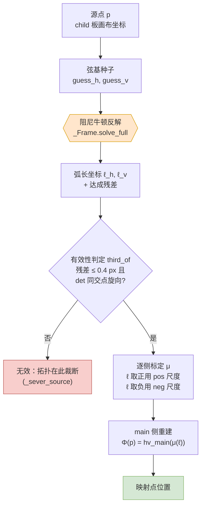
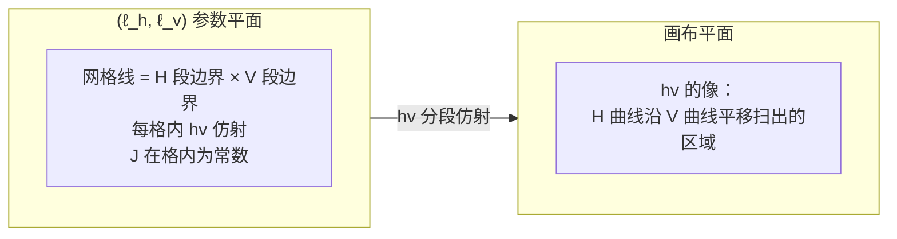
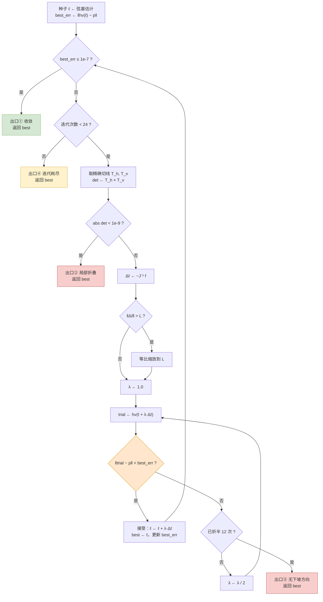
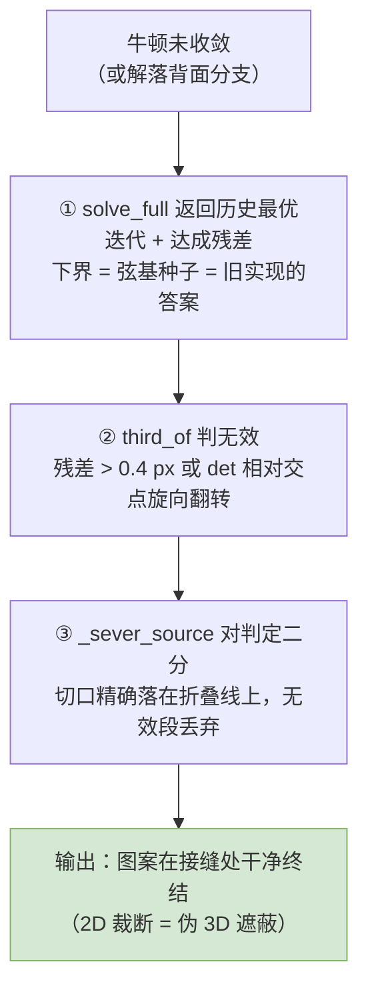

# 映射点位置是如何被预测出来的 —— 阻尼牛顿（下山）法完整说明

适用版本：`pyfile/auto_mapping.py`（Auto Mapping 2，2026-08 解耦重构之后）
配套文档：`docs/auto_mapping_2_spec.md`（算法规格），本文只讲**一个点的位置是怎么算出来的**。

> **更新（2026-08-24，拓扑裁断重构）**：残差项已被**彻底移除**，映射是纯分级复合
> `Φ(p) = hv_main(μ(ℓ))`。牛顿求解器本身**一字未改**——本文对它的全部推导、
> 流程图与实测表继续成立——变化只在**消费端**：反解失败（残差 > 0.4 px）或
> 解点行列式相对交点旋向翻转的点，不再由残差糊合，而是被判**无效**并在折叠线
> 上**裁断拓扑**（`third_of` / `_sever_source`，见规格 §4.6 与
> `topology_severing.md`）。下文凡提及"残差项兜底"处，按此注解读。
>
> **补注（2026-08-25 审查修复）**：`can_fold()` 为假的架上裁断整体关闭，
> 此时 hv_child 是同胚、原像必然存在，牛顿平台只是数值停摆（且只在
> **曲线**导引线上出现——折线导引线按 §8 有限步收敛）——**`_lift` 本体**
> 对残差超限的点从停摆迭代热重启一次（实测即收敛到 0；放在 `_lift` 让
> coords / third_of / 3D / Additional line 全体消费端一致），`map_point`
> 对仍超限者再以精确恒残差修正吸收（近平行曲线架实测 68 px 漂移 vs
> 旧公式逐位恒等）。可折架不走此分支：那里残差超限的语义仍是裁断。

---

## 0. 一句话概括

> 给定 child 板上的一个点 `p`，先**反解**出它在 child 参考架里的弧长坐标 `(ℓ_h, ℓ_v)`，
> 再把这对坐标**按侧缩放**到 main 板上，用**同一个**重建函数把点放回去。
> 反解这一步没有闭式解，用的就是阻尼牛顿法。

映射公式只有一行：

```
Φ(p) = hv_main( μ_h(ℓ_h), μ_v(ℓ_v) )        # 2026-08-24 起，无残差项
```

其中 `(ℓ_h, ℓ_v)` 满足 `hv_child(ℓ_h, ℓ_v) = p`。**牛顿法要解的就是这个方程。**
方程无解或解在背面分支的点不进入输出（拓扑在此裁断）。

---

## 1. 符号表

| 符号 | 含义 | 代码 |
|---|---|---|
| `H(a)` | H 导引线上弧长 `a` 处的点 | `_point_at_arc(self.h, self.h_cum, a)` |
| `V(b)` | V 导引线上弧长 `b` 处的点 | `_point_at_arc(self.v, self.v_cum, b)` |
| `O` | 两条导引线的交点 | `_Frame.origin` |
| `a₀, b₀` | 交点在 H / V 上的弧长 | `_Frame.h_arc`, `_Frame.v_arc` |
| `ℓ_h, ℓ_v` | **以交点为原点**的有符号弧长坐标 | `solve` 的返回值 |
| `hv(ℓ_h, ℓ_v)` | `H(a₀+ℓ_h) + V(b₀+ℓ_v) − O` | `_Frame.hv` |
| `J` | `hv` 的雅可比，两列即两条切线 | `_Frame.jacobian` |
| `μ_h, μ_v` | child 弧长 → main 弧长的逐侧标定 | `map_point.h_scales/v_scales` |
| `L` | 步长上限 `h_total + v_total + 1` | `solve` 里的 `limit` |

**关键约定**：`ℓ` 是**弧长**，不是弦投影、不是参数 `t`。child 侧和 main 侧用完全相同的度量，这是恒等性成立的前提（见 §7）。

---

## 2. 总体流程图



三个部件的分工：

* **重建项** `hv_main(μ(ℓ))` —— 承担全部形变，是"预测"的主体，也是公式的全部。
* **有效性判定** `third_of` —— 反解成功且落在正面分支才有 UV 坐标；否则该点位于折叠的背面或影子区，拓扑在折叠线上被裁断（笔画切断、无效段丢弃——2D 裁断伪造 3D 遮蔽）。
* **标定 μ** —— 把 child 的弧长按交点两侧分别拉伸到 main 的弧长，保证端点落端点、交点落交点。

---

## 3. 第一步：参考架 `_Frame` 的构造

`_Frame.__init__`（`pyfile/auto_mapping.py:447`）对一块板做一次性预处理：

```text
构造 _Frame(h_points, v_points):
    h_cum ← 累计弧长(h_points)              # 前缀和，供二分查找
    v_cum ← 累计弧长(v_points)
    O, a₀, b₀ ← 两条折线的真实交点及其弧长    # _polyline_intersection
        若两线不相交 → 退化为最近顶点对的中点
    h_side ← (max(a₀, 1%·h_total), max(h_total−a₀, 1%·h_total))   # 带下限，防除零
    v_side ← 同理
    h_side_raw ← (a₀, h_total−a₀)           # 不带下限，供 μ 判断"侧是否真的塌缩"
    h_window ← max(2·POLY_STEP, 3%·h_total) # 仅用于方向平滑，见 §5.2
```

要点：

1. **原点是交点，不是起点。** 早期实现用弦和起点建系，导致交点两侧的比例错配；改成以交点为原点后，`ℓ = 0` 天然对应两板互相钉住的那一点。
2. **1% 下限**只用于分母，`_raw` 版本保留真值。二者混用曾造成 `_transfer_scales` 里的混合权恒等于 1（死代码），已修正。

---

## 4. 第二步：正问题 `hv` —— 它为什么是**分段仿射**的

```python
def hv(self, l_h, l_v):
    on_h = _point_at_arc(self.h, self.h_cum, self.h_arc + l_h)
    on_v = _point_at_arc(self.v, self.v_cum, self.v_arc + l_v)
    return (on_h[0] + on_v[0] - self.origin[0],
            on_h[1] + on_v[1] - self.origin[1])
```

`_point_at_arc` 在一条**折线**上按弧长取点：落在第 `i` 段内时是该段两端的线性插值，超出两端时沿首/末段**线性外推**。因此

> 在 `(ℓ_h, ℓ_v)` 平面上，把 H 的段边界和 V 的段边界画成网格线，
> `hv` 在**每一个网格单元内部都是严格仿射**的，
> 其雅可比在单元内是常数：两列就是该段的单位方向向量。



这条性质是全文的支点：**牛顿法在分段仿射映射上是有限步收敛的**——一旦迭代点落进正确的单元，那一步的线性模型就是精确的，下一步残差直接归零（数值上到 1e-14）。§8 有完整论证，§9 表 3 有实测轨迹佐证。

---

## 5. 第三步：逆问题 —— 阻尼牛顿（下山）法

要解的方程：

```
F(ℓ_h, ℓ_v) = hv(ℓ_h, ℓ_v) − p = 0      (二维非线性方程组)
```

### 5.1 种子：弦基估计（迭代 0）

`build_mapper.coords`（`pyfile/auto_mapping.py:671` 附近）先用**弦基**给一个初值：

```text
e_h ← child H 首尾连线的一半
e_v ← child V 首尾连线的一半
det ← cross(e_h, e_v)
d   ← p − O
guess_h ← (d × e_v)/det · ½·|H 弦长|
guess_v ← (e_h × d)/det · ½·|V 弦长|
```

这正是 2026-08 重构**之前**整套实现所用的坐标。它的意义有两层：

* **导引线为直线时，弦基就是精确解**，牛顿 0 次迭代直接命中（实测种子误差 0.00 px，见 §9 表 1 第一行）。
* 它把新实现**下界锚定**在旧实现上：迭代 0 就是旧答案，之后只可能变好。

⚠️ 弦基还有一处不可省的用途：`build_mapper` 用 `axis_sin < 0.05`（约 3°）拒收近乎平行的 child 导引线——那种情况下参考架根本不成立，反解无从谈起。

### 5.2 雅可比：必须用**逐段精确切线**，不能用平滑切线

`_Frame` 里有两个求方向的函数，用途严格分离：

| 函数 | 返回 | 用途 |
|---|---|---|
| `jacobian(ℓ_h, ℓ_v)` | 当前段的**精确**单位方向 | **只**给牛顿法当导数 |
| `directions(ℓ_h, ℓ_v)` | 在 `±window` 弧长上做中心差分的**平滑**方向 | **只**给朝向判定（`_orientation` / 折叠 / 镜像） |

这不是风格问题：`_direction_at_arc` 的分支结构（含两端的线性外推）与 `_point_at_arc` **逐条对应**，所以它确实是 `hv` 的导数。若把平滑切线塞进牛顿，线性模型与真实函数不再匹配，收敛性立刻失效。反过来，手绘导引线的逐段切线抖动会让朝向判定在几个像素内反复翻转（实测在一条 301 点的导引线上，折叠计数在 2 和 4 之间振荡了 11 次），所以朝向那一侧必须平滑。

代码里的注释把这条规则写在了 `directions` 的 docstring 第一行。

### 5.3 牛顿步

在当前迭代点 `(ℓ_h, ℓ_v)` 上，令 `f = hv(ℓ) − p`，`J = [T_h | T_v]`（两列为两条切线）：

```
det = T_h.x·T_v.y − T_h.y·T_v.x

若 |det| < 1e-9 → 该处参考架局部折叠，无可用方向，退出

Δℓ_h = (−f.x·T_v.y + f.y·T_v.x) / det
Δℓ_v = (−T_h.x·f.y + T_h.y·f.x) / det
```

即 `Δℓ = −J⁻¹ f` 的二维显式展开（克拉默法则，无需矩阵库）。

几何解释很直观：**把残差向量在两条切线张成的斜角坐标系里分解**，一个分量沿 H 走，一个分量沿 V 走。两条切线越接近平行，`det` 越小，分解越病态——这正是强弯导引线的困难所在。

### 5.4 步长截断

```
L = h_total + v_total + 1
若 |Δℓ| > L → 等比缩放到 L
```

单次跳跃不允许超过"整条 H 加整条 V 的长度"。这是防止 `det` 很小时把迭代点甩到天外的硬护栏。实测在 bow 60 上触发 309 次，bow 100 上 450 次（§9 表 1 `clamp` 列）。

### 5.5 下山：回溯阻尼（本次重构的核心改动）

朴素牛顿在强弯导引线上**不收敛，而且是周期性的**。实测残差序列：

```
6.62 → 6.17 → 5.40 → 15.9 → 6.57 → 5.40 → 15.9 → …   （永远循环）
```

原因是 `hv` 在切线转平行处**非单射**，牛顿步在两个单元之间来回跨越，每次都"跳过头"。

改法是标准的**回溯线搜索（下山法）**：沿牛顿方向逐次折半，直到残差**真的下降**才接受。

```python
accepted = None
damping = 1.0
for _ in range(12):                      # 最多折半 12 次，λ 最小 1/4096
    trial_h = l_h + step_h * damping
    trial_v = l_v + step_v * damping
    trial = self.hv(trial_h, trial_v)
    error = math.hypot(trial[0] - point[0], trial[1] - point[1])
    if error < best_error:               # 只接受"真的更好"
        accepted = (trial_h, trial_v, trial, error)
        break
    damping *= 0.5
if accepted is None:
    break                                # 该方向上无下坡路，保留历史最优
l_h, l_v, current, best_error = accepted
best = (l_h, l_v)
```

三点设计考量：

1. **只接受改进**（`error < best_error`），所以 `best_error` 单调不增——这就是"下山"的字面含义，也保证了最终答案不会劣于种子。
2. **简单路径零开销**：`damping = 1.0` 的首次试探若被接受，就与朴素牛顿完全一样。实测直线 / bow 10 / bow 30 的迭代次数**逐位不变**（§9 表 2）。
3. **无下坡路 = 合法终止**，不是 bug。此时 `break` 保留历史最优，`solve_full` 把达成残差一并交给调用方——残差超过 0.4 px 即触发裁断（见文首更新注）。

### 5.6 完整伪代码

```text
函数 solve(point p, seed (g_h, g_v), iterations = 24, tol = 1e-7):

    L ← h_total + v_total + 1
    (ℓ_h, ℓ_v) ← (g_h, g_v)
    current   ← hv(ℓ_h, ℓ_v)
    best_err  ← |current − p|
    best      ← (ℓ_h, ℓ_v)                      # 迭代 0 = 弦基种子

    重复 iterations 次:

        若 best_err ≤ tol:  跳出                 # 出口①：收敛

        f ← current − p
        (T_h, T_v) ← jacobian(ℓ_h, ℓ_v)          # 精确逐段切线
        det ← T_h × T_v
        若 |det| < 1e-9:  跳出                   # 出口②：局部折叠

        Δℓ_h ← (−f.x·T_v.y + f.y·T_v.x) / det    # −J⁻¹f，克拉默展开
        Δℓ_v ← (−T_h.x·f.y + T_h.y·f.x) / det
        若 |Δℓ| > L:  等比缩放到 L                # 步长护栏

        accepted ← 空                            # ── 回溯线搜索 ──
        λ ← 1.0
        重复 12 次:
            trial ← hv(ℓ_h + λ·Δℓ_h, ℓ_v + λ·Δℓ_v)
            若 |trial − p| < best_err:
                accepted ← (ℓ + λ·Δℓ, trial, |trial − p|)
                跳出
            λ ← λ / 2
        若 accepted 为空:  跳出                   # 出口③：该方向无下坡

        (ℓ_h, ℓ_v), current, best_err ← accepted
        best ← (ℓ_h, ℓ_v)

    返回 best                                    # 永远是见过的最优迭代
```

### 5.7 求解器流程图



四个出口中，只有**出口①**代表 `ℓ` 精确；其余三个都返回"见过的最优"，达成残差由 `solve_full` 上报——残差超过 0.4 px 的点被 `third_of` 判为无效并裁断（§7）。

---

## 6. 第四步：逐侧标定 μ

反解得到 `ℓ` 之后，要把它送到 main 板上。**交点把每条导引线分成两侧，两侧各自独立标定**：

```python
image = main.hv(l_h * (h_scale_pos if l_h >= 0.0 else h_scale_neg),
                l_v * (v_scale_pos if l_v >= 0.0 else v_scale_neg))
```

尺度由 `_transfer_scales`（`pyfile/auto_mapping.py:567`）给出：

```text
floor ← 1% · child_total
base_neg ← main_neg / max(raw_neg, floor)
base_pos ← main_pos / max(raw_pos, floor)
w_neg ← clamp(raw_neg / floor, 0, 1)          # 连续斜坡，不是硬 if
w_pos ← clamp(raw_pos / floor, 0, 1)
scale_neg ← (1−w_neg)·base_pos + w_neg·base_neg
scale_pos ← (1−w_pos)·base_neg + w_pos·base_pos
```

**为什么要斜坡混合**：当交点落在导引线端点上（T 形相交），该侧长度趋于 0，直接相除会得到约 100 倍的放大器。旧代码用一个硬 `if` 切到对侧尺度，结果映射在阈值处**不连续**——把交点移动 1e-7 px 跨过阈值，映射点跳 ~200 px（实测）。斜坡在 `[0, floor]` 上把两种行为连续地接起来：`raw = 0` 时完全用对侧尺度，`raw ≥ floor` 时就是纯比值。

两侧尺度不等会让**跨越导引线的笔画产生折叠**，比值记在 `info["h_scale_mismatch"]` / `info["v_scale_mismatch"]` 里。

---

## 7. 第五步：有效性判定 + 正向投射，以及恒等性定理

```python
def third_of(point):                       # 提升 + 判定
    l_h, l_v, residual = child.solve_full(point, *chord_seed(point))
    if residual > 0.4:  return l_h, l_v, False        # 无原像：影子区
    t_h, t_v = child.directions(l_h, l_v)             # 窗口平滑切向
    return l_h, l_v, (t_h × t_v) · child_hand > 0     # 背面分支同样无效

def map_point(point):                      # Child → Third → Main，字面复合
    return main_of_third(coords(point))

def main_of_third(third):                  # 纯正向，无牛顿
    l_h, l_v = warp(third) if warp else third
    return main.hv(μ_h(l_h), μ_v(l_v))
```

**恒等性定理**：若 child 与 main 画了完全相同的导引线，则在可计算面上 `Φ(p) = p`，**与导引线形状无关**。

证明一行：两板相同 ⇒ `μ = id` 且 `hv_main ≡ hv_child` ⇒ `Φ = hv_child ∘ hv_child⁻¹ = id`，精度即反解精度。∎

直线导引线的弦种子**就是**精确解（迭代 0 退出），恒等逐位成立；弯曲导引线到牛顿容差（实测振幅 30 正弦架 `7.1e-14` px——容差 `1e-7` 只是出口阈值，§8 的有限步收敛让实际解落在机器精度）。**反解失败的点不再被恒等地"搬回去"**：残差时代那 63/625 个未收敛探针靠 `p − hv_child(ℓ)` 假装恒等，如今它们被裁断——不存在的坐标没有资格恒等。

历史注记：残差项的本意是对抗旧纯弦式实现的系统性位移（child 导引线一弯，图案整体位移 28–157 px，哪怕两板画得一模一样）。弧长反解取代弦分解后，收敛点上残差恒为零，它只剩"糊住折叠区"这一个作用——而那正是 2026-08-24 用拓扑裁断取代掉的行为。

---

## 8. 收敛性：为什么这里的牛顿是**有限步**的

标准牛顿只有局部二次收敛的保证。这里能说得更强：

1. `hv` 在 `(ℓ_h, ℓ_v)` 平面的每个网格单元内**严格仿射**（§4）。
2. 在单元内部，牛顿的线性模型 **等于** 真实函数，因此单步即精确解——只要该解仍落在同一单元内。
3. 于是迭代只会做两件事：跨到相邻单元，或者在正确单元里一步归零。单元数有限 ⇒ 若解存在且路径单调，**有限步终止**。

实测的残差轨迹正是这个形状（§9 表 3）：

```
bow 10 :  2.37e+01 → 4.62e-01 → 3.46e-03 → 2.84e-14
bow 30 :  7.39e+01 → 6.28e+01 → 1.41e+01 → 7.70e-01 → 5.91e-04 → 4.02e-14
```

前几步在"找对单元"，最后一步直接落到机器精度——不是渐进收敛，是**一步到底**。这也解释了为什么容差取 `1e-7` 却总能拿到 `1e-14`：跨过 `1e-7` 那一刻其实已经精确了。

**这个论证在哪里失效**：`hv` 非单射的地方。两条切线转到接近平行时，同一个 `p` 在参数平面上有多个原像，或者根本没有原像；单调下降的路径不存在，迭代在单元之间循环。阻尼把"循环"变成"停在平台上"（表 3 的 bow 60/100 行），但停下来并不等于解出来。

---

## 9. 实测数据

测试装置：child H/V 为正弦弯曲折线（101 点，周期 300 px，振幅列于左栏），400×400 画布上 25×25 = **625 个探针点**，容差 `1e-7` px。脚本为 `_Frame.solve` 的逐行忠实副本 + 计数器。

### 表 1 —— 现行求解器的行为

| child 导引线 | 种子误差 中位/最大 | 迭代数 中位/最大/均值 | `hv` 调用/点 | 解到 1e-7 | 触发截断 | 折半次数 |
|---|---|---|---|---|---|---|
| 直线 | 0.00 / 0.00 | 0 / 0 / 0.00 | 1.00 | **100.0%** | 0 | 0 |
| bow 10 px | 15.09 / 30.91 | 2 / 3 / 2.03 | 3.03 | **100.0%** | 0 | 0 |
| bow 30 px | 35.85 / 95.96 | 3 / 5 / 2.83 | 3.86 | **100.0%** | 0 | 20 |
| bow 60 px | 70.92 / 185.20 | 4 / 24 / 4.36 | 12.29 | 89.9% | 309 | 3679 |
| bow 100 px | 114.95 / 231.26 | 4 / 24 / 5.69 | 27.08 | 64.2% | 450 | 10390 |

直线一行值得单独看：种子误差恒为 0，迭代 0 次，`hv` 只调用一次。**弦基种子在直线情形是精确解**，整个牛顿机器完全不启动。

### 表 2 —— 有无阻尼的对比（同一批探针）

| child 导引线 | 朴素牛顿 解出率 | 阻尼下山 解出率 | 朴素 平均迭代 | 阻尼 平均迭代 |
|---|---|---|---|---|
| 直线 | 100.0% | 100.0% | 0.00 | 0.00 |
| bow 10 px | 100.0% | 100.0% | 2.03 | 2.03 |
| bow 30 px | 100.0% | 100.0% | 2.85 | 2.83 |
| bow 60 px | 59.5% | **89.9%** | 3.18 | 4.36 |
| bow 100 px | 54.6% | **64.2%** | 5.08 | 5.69 |

结论：**容易的情形一分钱不多花**（前三行迭代数逐位相同），困难的情形解出率从 59.5% 提到 89.9%。

### 表 3 —— 残差轨迹（各配置中迭代次数最多的那个探针）

```
直线      : 0.00e+00
bow 10 px : 2.37e+01 → 4.62e-01 → 3.46e-03 → 2.84e-14
bow 30 px : 7.39e+01 → 6.28e+01 → 1.41e+01 → 7.70e-01 → 5.91e-04 → 4.02e-14
bow 60 px : 5.85e+01 → 4.88e+01 → 4.81e+01 → 4.79e+01 → 4.79e+01 → 4.79e+01 → …
bow 100 px: 9.26e+01 → 6.45e+01 → 5.76e+01 → 4.74e+01 → 4.74e+01 → 4.74e+01 → …
```

前两行是 §8 描述的有限步收敛；后两行是阻尼的效果——**卡在平台上，而不是像朴素牛顿那样在 6.6/5.4/15.9 之间永久振荡**。停在平台上的点，其残差远超 0.4 px——正是表 4 的"无原像/多原像"病态点，如今由裁断处置。

### 表 4 —— 没解出来的点，到底是谁的问题？

对每个未达 1e-7 的探针，在参数平面上以 3 px 步长暴力扫描，统计 `hv` 有多少个原像落在该点 3 px 内：

| child 导引线 | 未解出 | 根本无原像 | 原像多于一个 | **求解器真的漏了** | 残差 中位/最大 (px) |
|---|---|---|---|---|---|
| bow 30 px | 0 | 0 | 0 | **0** | — |
| bow 60 px | 63 | 21 | 41 | **1** | 15.19 / 60.18 |
| bow 100 px | 224 | 91 | 133 | **0** | 29.84 / 134.47 |

这是本文最重要的一张表：**未收敛几乎全部是问题本身病态，而不是求解器失职**。

* *根本无原像*——该点位于参考架扫掠不到的区域，方程无解；
* *原像多于一个*——参考架在那里真的折叠了，方程有多解，"哪个才对"没有定义。

bow 60 上仅 1 个、bow 100 上 0 个属于"方程有唯一解但没找到"。

这张表也是**拓扑裁断的正当性证明**：两类病态点正是 `third_of` 判无效的两个分支（残差超阈 = 无原像；det 翻转 = 折叠多解），它们的残差中位 15–30 px、最大 60–134 px——残差项从来不是在"兜底"，而是在把几十像素的病态涂进输出。裁断以后这些点根本不出现。

### 表 5 —— 代价

| 指标 | 加阻尼前 | 加阻尼后 | 变化 |
|---|---|---|---|
| `map_point` 单点耗时 | 8.42 µs | 9.31 µs | **+10.6%** |
| 直线配置输出（300 组回归） | — | — | 逐位相同，最大偏差 `0.000e+00` |
| 恒等误差 | 4.0e-14 | 4.0e-14 | 不变 |

外加一组独立测量：中等弯曲 child + 弯曲 main 的组合下 `map_point` 为 9.52 µs/点。

---

## 10. 失败不是 bug —— 裁断链



朝向判定（`_fold_sign`）与判定的 det 半边都用 `directions` 的**窗口平滑切线**，与 solve 的精度解耦——对应代码里的三处注释：`solve_full` 的 docstring 末段、`build_mapper` 里 `third_of` 的 docstring、`directions` 的 docstring 首段。

---

## 11. 谁在消费这些坐标

`map_point` 对象上挂着求解器的全部中间量，下游据此工作：

| 属性 | 消费者 | 用途 |
|---|---|---|
| `.third_of` | `_sever_source` / `_sever_cubics_by_child_fold` / `_split_ring_by_fold` / 主板参考网格 | 提升 + 有效性判定：无效即裁断 |
| `.main_of_third` | `map_point` 本体、参考网格 | Third→Main 纯正向投射（无牛顿） |
| `.can_fold` | 一切裁断入口 | 帧全局闸门：不可折的架零开销 |
| `.coords` | `_orientation` (`:1798`) | 取 `ℓ` 后求 `det J` 的符号 |
| `.child_frame` / `.main_frame` | `_crease_curves` (`:1904`) | 沿参考架采样求折痕 |
| `.h_scales` / `.v_scales` | `_orientation` | `det J = σ_h σ_v · sin∠(T_m,N_m) / sin∠(T_c,N_c)` |
| `.fold_reference` | `_fold_sign` (`:1814`) | 交点处的朝向 = 正面基准 |

`_structural_knots`（`:988`）会在 child 导引线切线发生变化的**单元边界**上强制插入采样点——那正是 §4 网格线的像。这样一来，映射后的折线不会在单元边界处被弦切掉：实测弯曲 child 导引线上的最大偏差从 37 px 降到 0.43 px。

**朝向判定与求解精度是解耦的**：`_orientation` 拿到 `ℓ` 之后用的是 `directions` 的平滑切线，所以即使 `ℓ` 只是"最优近似"，正/背面分类依然稳定。

---

## 12. 复杂度

| 阶段 | 复杂度 | 说明 |
|---|---|---|
| `_Frame` 构造 | `O(n_H + n_V)` + `O(n_H · n_V)` | 前缀和 / 交点为逐段暴力求交，每次映射只做一次 |
| `_point_at_arc` | `O(log n)` | `bisect` 二分 |
| 单次牛顿迭代 | `O(log n)` | 2 次 `_point_at_arc` + 2 次 `_direction_at_arc` |
| 线搜索 | 最多 12 × `O(log n)` | 简单路径只试 1 次 |
| 单点映射 | 平均 `O(k log n)`，`k ≤ 24` | 实测 `k` 均值 0–5.7 |

---

## 13. 已知局限

1. **强弯导引线上 `hv` 非单射。** 表 4 已经说明这是问题本身的性质。真要解决，得改的是"多解时选哪一个"的定义（例如沿笔画做连续延拓），而不是换求解器。
2. **`fold_reference` 只在交点处取一次。** 若图案跨越多重折叠，正/背面是相对交点的**奇偶**关系，当前实现只区分两面。
3. **笔宽只有一个全局几何平均尺度。** 两侧尺度不等时它只是近似。
4. **`iterations = 24` 与 12 次折半是经验常数**，未做自适应。表 1 显示中位迭代数从未超过 4，上限只在病态点上触发。

---

## 附录 A：常量

| 常量 | 值 | 位置 | 作用 |
|---|---|---|---|
| `tol` | `1e-7` px | `solve` 签名 | 收敛判据（实际总能到 1e-14） |
| `iterations` | `24` | `solve` 签名 | 迭代上限 |
| 折半上限 | `12` | `solve` 内 | λ 最小 `1/4096` |
| `det` 阈值 | `1e-9` | `solve` 内 | 局部折叠判定 |
| `limit` | `h_total+v_total+1` | `solve` 内 | 单步位移上限 |
| 侧长下限 | `1%` | `_arc_sides` / `_transfer_scales` | 防 T 形交点除零 |
| 方向平滑窗 | `max(2·POLY_STEP, 3%·total)` | `_Frame.__init__` | 仅用于朝向判定 |
| 平行拒收阈值 | `axis_sin < 0.05`（≈3°） | `build_mapper` | 参考架不成立 |

## 附录 B：代码索引

| 位置 | 函数 | 角色 |
|---|---|---|
| `pyfile/auto_mapping.py:272` | `_cumulative_lengths` | 弧长前缀和 |
| `:289` | `_point_at_arc` | **正问题的原子**：折线上按弧长取点 |
| `:309` | `_direction_at_arc` | **雅可比列**：与上者分支逐条对应 |
| `:328` | `_tangent_at_arc` | 平滑切线，只给朝向判定 |
| `:386` | `_polyline_intersection` | 交点及其两侧弧长 |
| `:437` | `_Frame` | 参考架 |
| `:485` | `_Frame.hv` | `H + V − O` |
| `:492` | `_Frame.jacobian` | 精确切线对 |
| **`:497`** | **`_Frame.solve`** | **本文主题：阻尼牛顿** |
| `:567` | `_transfer_scales` | 逐侧标定 μ，含连续斜坡 |
| `:592` | `build_mapper` | 组装 `coords` / `map_point` |
| `:988` | `_structural_knots` | 单元边界强制采样 |
| `:1798` | `_orientation` | `det J` 符号 |
| `:1814` | `_fold_sign` | 相对交点的正/背面 |

（行号为撰写时的位置，函数名是稳定的检索键。）
