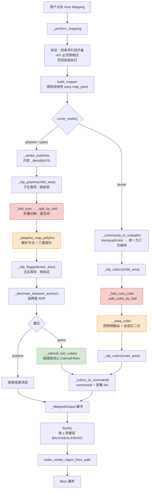
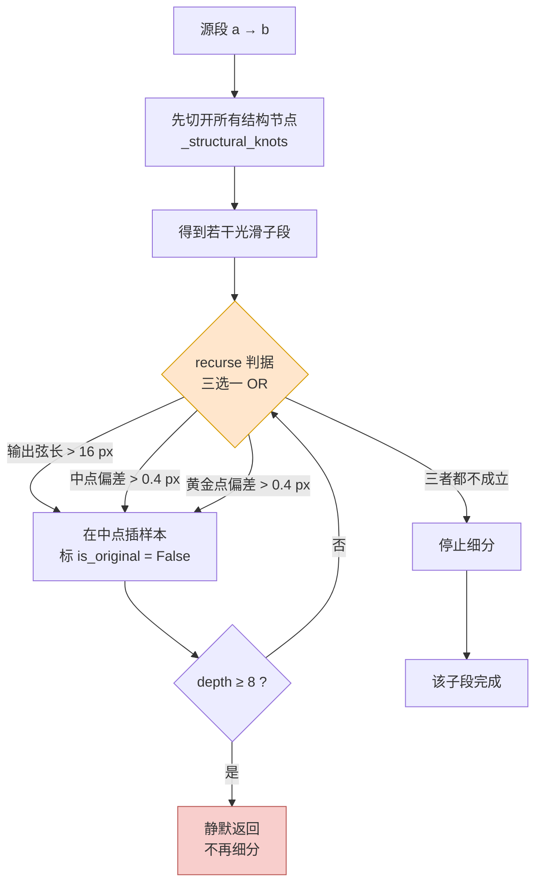
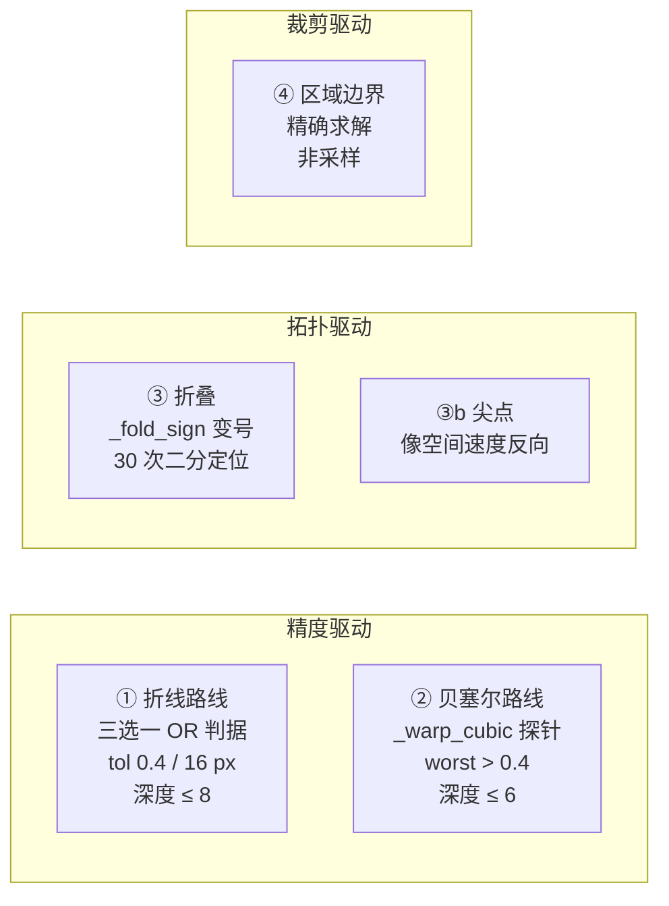
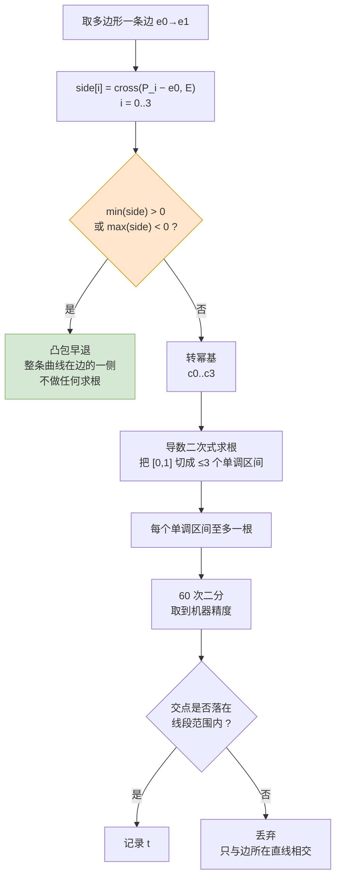

# 笔画映射管线：从 Child 纹理到 Main 画面的离散、切断与拟合

适用版本：`pyfile/auto_mapping.py`（Auto Mapping 2），核查基准 HEAD `cdea7d0`，文件 3026 行。
配套文档：

* `docs/point_mapping_newton.md` —— **单个点**如何被预测（阻尼牛顿反解）。本文不重复。
* `docs/auto_mapping_2_spec.md` —— 算法规格。

本文只讲**曲线/笔画这一层**：`map_point` 是非线性 warp，单个贝塞尔控制点各自变换**无法保持贝塞尔拓扑**，系统是怎么处理的。

> **⚠️ 行号会漂移。** 本文撰写期间 `auto_mapping.py` 在另一个会话中被实时编辑，一小时内从约 2600 行长到 3026 行。**函数名是稳定检索键**，行号仅供参考。

---

## 0. 一个必须先纠正的前提

> **代码库里不存在"艺术家画的贝塞尔曲线"。**

笔画路径是 C++ 从采样点**合成**的。`AnimeVectorLogic::makeStroke`（`algorithm/vectorlogic.cpp:257`）：


关键代码（`vectorlogic.cpp:208-214`）：

```cpp
for (int i = 1; i < smoothed.size(); ++i) {
    const QPointF control = smoothed[i - 1];
    const QPointF end = (smoothed[i - 1] + smoothed[i]) / 2.0;
    path.quadTo(control, end);
}
path.lineTo(smoothed.last());
```

因此：

* `auto_mapping.py` 里 "bezier 模式保留艺术家的 Bezier 段" 这一说法**不准确**——它搬运的是**平滑器合成的二次曲线的控制柄**，其控制点是一个被平滑过的输入**采样点**。
* `pathCommandsToList` 只发 `move` / `line` / `cubic`，**没有 quad 生产者**，所以 `_commands_to_subpaths` 里的 quad 分支（二次升三次）对来自 `cell_to_dict` 的笔画是死代码。
* `smoothPath = false` 是可达的（`openglwidget.h:201` 暴露此开关）。此时 `stroke.path` 退化为纯 `lineTo` 链（`makePolylinePath`），bezier 模式只会收到 `line` 命令，全部走 `_line_cubic`，**这条"保曲率"路线一点曲率都没有**。

---

## 1. 总管线

三种 `curve_mode()` 共享同一副骨架，只在**入口表示**和**出口拟合**上分叉。



### 三条路线逐段对照

| 步骤 | `polyline` | `spline`（默认） | `bezier` |
|---|---|---|---|
| 入口 | `_stroke_polylines` | `_stroke_polylines` | `_commands_to_subpaths` |
| 预重采样 | `_densify(4.0)` | `_densify(4.0)` | **无** |
| 子区裁剪 | `_clip_polyline` | `_clip_polyline` | `_clip_cubics` |
| 折叠切断 | `_fold_runs` | `_fold_runs` | `_fold_runs_cubic` |
| 映射 | `_adaptive_map_polyline` | `_adaptive_map_polyline` | `_warp_cubic` |
| 主区裁剪 | `_clip_flagged` | `_clip_flagged` | `_clip_cubics` |
| 抽稀 | `_decimate_between_anchors` | `_decimate_between_anchors` | **无**（不读 RDP 滑杆） |
| 拟合 | **无** | `_catmull_rom_cubics` | **无**（柄已搬运） |
| 输出 | `add_polyline` | `add_curved` | `add_curved` |

`_collect_pattern_strokes(..., want_commands = mode == "bezier")` 这**一个布尔**决定了 C++ 返回 `polylines` 还是 `commands`——两者互斥。

---

## 2. 离散化：三级，步长各不相同

| 级 | 位置 | 公式 | 要点 |
|---|---|---|---|
| C++ `pathToPolylines` | `python_bindings.cpp:439-450` | `max(1, ceil(控制网长 / max(0.1, poly_step)))`，`poly_step = 4.0` | 均匀取 t；**`lineTo` 完全不细分**；`moveTo` 开启新 polyline，一笔可产出多条 |
| Python `_densify` | `auto_mapping.py:1925` | `count = max(1, round(length/4.0)) if step > 0 else 1` | 用 `round()` 而非 `ceil()`：**只有 ≥ 6.0 px 的段才会被分开**，5.9 px 的段原样保留 |
| `_path_commands_to_polygons`（仅裁剪多边形） | `:730` | `max(4, min(24, ceil(net / 6.0)))` | 步长是 **6.0**，不是 `POLY_STEP` |

`round()` 是刻意的，注释写明：展平后的曲线间距已经在 `step` 附近，`ceil()` 会把每一段都再切一刀。

### ⚠️ 由此产生的一个实际后果

送进 `_adaptive_map_polyline` 的"原始顶点"**并不是艺术家的顶点**，而是：

```
_densify(4.0) 输出的 ~4–6 px 网格
  + child 区裁剪切点（_clip_polyline 重建每个点）
  + 折叠切断的 run 端点
  + main 区裁剪切点（_clip_flagged 标 True）
```

这些点**全部**标 `is_original = True`。因此 `_decimate_between_anchors` **永远无法把结点稀疏到该网格以下**——RDP 滑杆只能删掉一个 4 px 跨度**内部**新插入的样本。

spline 模式的 Catmull-Rom 于是是在插值一张至少这么密的网格。`_decimate_between_anchors` 的注释"dense warp samples collapse back to the few knots the curvature needs"**高估了**可达的抽稀程度。

---

## 3. 自适应采样

### 3.1 `_structural_knots` —— 解析节点（`:1002`）

这是自适应采样的核心。机制比"在切线突变处插点"更具体：**它不沿源段行走，而是直接枚举导引线顶点的弧长值，再线性反插回源段参数**。

```text
函数 _structural_knots(map_point, a, b):

    若 map_point 无 coords 属性:  返回 []        # 静默失效，只剩探针兜底

    start ← coords(a)                            # 2 次牛顿反解
    end   ← coords(b)

    对每个轴 axis ∈ {H, V}:
        (l0, l1) ← (start[axis], end[axis])
        若 |l1 − l0| ≤ 1e-12:  跳过该轴

        # 目标 1：child 导引线自身的内部顶点（坐标本身在此断裂）
        targets ← [ v − own_arc  for v in own_cum[1:-1] ]

        # 目标 2：main 导引线的内部顶点，经逐侧尺度拉回 child 坐标
        对 v in far_cum[1:-1]:
            offset ← v − far_arc
            scale  ← scale_pos 若 offset ≥ 0 否则 scale_neg
            若 |scale| > 1e-12:  targets += [ offset / scale ]

        (lo, hi) ← 排序后的 (l0, l1)
        对 target in targets:
            若 lo < target < hi:                 # 严格包含
                knots += [ (target − l0) / (l1 − l0) ]   # ★ 纯线性插值

    knots ← 去重排序，保留 1e-9 < t < 1−1e-9
    若 len(knots) > 48:                          # _MAX_KNOTS_PER_SPAN
        stride ← len(knots) / 48
        knots  ← [ knots[min(len−1, int(i·stride))] for i in 0..47 ]   # 均匀抽稀，静默
    返回 knots
```

四个要点：

1. **同时取 child 和 main 两侧的顶点。** 主导引线的折点在子空间里同样是映射的不可微处——这是"为什么只看 child 不够"的答案。
2. **切片 `[1:-1]` 有依据**：`_point_at_arc` 在导引线两端做**线性外推**，所以首尾顶点确实不带切线断点。
3. **第 4 步的线性插值是一个近似。** 它假设弧长坐标沿源段线性变化。一个区间跨多个节点时，第一个之后的位置只是近似——规格文档自己承认了这点。该误差在**折叠切断**处被 30 次二分修正（§4.2），但在**采样器自身**里没有对应修正，只靠探针兜底。
4. **溢出是均匀抽稀，不是截断，且完全静默。**

### 3.2 数值探针（`_adaptive_map_polyline`，`:1058`）

判据是**三选一的 OR**，任一成立就在中点插样本并左右递归：

```python
if (_dist(wa, wb) > _FORCE_STEP                        # 输出弦长 > 16.0 px
        or _dist(wm, _mid(wa, wb)) > tol               # 中点偏差 > 0.4 px
        or _dist(wg, _lerp(wa, wb, _PROBE_T)) > tol):  # 黄金分割点偏差 > 0.4 px
    recurse(a, m, wa, wm, depth + 1)
    result.append((wm, False))
    recurse(m, b, wm, wb, depth + 1)
```



**为什么用黄金分割 `_PROBE_T = 0.381966` 而不是再取一个中点**：一条直源段横跨波形主导引线的整数个周期时，其像的中点偏差**恰好为零**，单探针会被彻底骗过。黄金分割相对中点是无理比，破坏周期对齐。`_FORCE_STEP = 16.0` 是同一问题的第二道保险——不论探针怎么说，输出弦长超过 16 px 就必须再切。

执行顺序是**先解析节点、后数值细分**（`:1092-1103`）：先在每个结构节点处切开并把它作为样本 append，再让探针细化每个光滑子段。

---

## 4. 切断：四种独立条件



### 4.1 精度切断

| | 折线路线 | 贝塞尔路线 |
|---|---|---|
| 函数 | `_adaptive_map_polyline.recurse` | `_warp_cubic`（`:1174`） |
| 探针 | 中点 + 黄金点 | `probes = max(3, min(17, ceil(net / 16.0)))` 均匀点 + 黄金点 |
| `net` | —— | **输出**控制多边形长度 `dist(w0,c1) + dist(c1,c2) + dist(c2,w3)` |
| 误差度量 | 像 vs 弦 | `dist(map_point(cubic(t)), out_cubic(t))`，**同参数对齐** |
| 阈值 | `_CURVE_TOL = 0.4` | `_CURVE_TOL = 0.4` |
| 切法 | 中点插值 | 源三次曲线在 t=0.5 处二分 |
| 深度 | `_SPLINE_MAX_DEPTH = 8` | `_BEZIER_MAX_DEPTH = 6` |

> `_warp_cubic` 的 docstring 已过时：写着"在 t=1/4,1/2,3/4 检验"，实际是 `probes` 自适应个数，只有 `probes == 3` 的下限情形才退化成三点。

### 4.2 拓扑切断（`_split_by_fold`，`:2008`）—— 唯一真正的"拓扑死结"处理

判据是 `_fold_sign` **相对 `map_point.fold_reference`**（交点处定义为正面）的符号变化，**不是** `det J < 0` 的绝对符号——后者在两板手性相反时会把整幅图判成背面。

```text
函数 _split_by_fold(map_point, points):

    # 第一步：按结构节点把每个源段切成 cell，每个 cell 取中点定 side
    对每个源段 (a, b)，index 递增:
        bounds ← [0.0] + _structural_knots(map_point, a, b) + [1.0]
        对相邻 (t0, t1):
            若 t1 − t0 ≤ 1e-12:  跳过
            pieces += [ index, a, b, t0, t1,
                        _fold_sign(map_point, lerp(a, b, (t0+t1)/2)) ]

    # 第二步：把每处 side 变化二分到真实边界上
    对相邻 (left, right) in pieces:
        若 left.side == right.side 或 left.index != right.index:  跳过
        lo ← (left.t0 + left.t1)/2
        hi ← (right.t0 + right.t1)/2
        重复 30 次:                              # ★ 唯一的节点精化
            mid ← (lo + hi)/2
            若 _fold_sign(lerp(a, b, mid)) == left.side:  lo ← mid
            否则:                                          hi ← mid
        boundary ← (lo + hi)/2
        left.t1 ← boundary                       # ★ 两侧写同一个值
        right.t0 ← boundary

    # 第三步：把同 side 的相邻 cell 合并成 run
    ...
```

三个设计要点：

1. **为什么需要二分**：结构节点来自**线性插值**（§3.1 要点 3），在粗源段上可能偏离真实 cell 边界几个像素。而折痕（crease）是**独立地从参考架推导**的，若切点不落在折痕上，两条推导就对不上。`_fold_sign` 是精确的，二分把切点钉死，两种推导**按构造一致**。
2. **`left.t1` 与 `right.t0` 写入同一个值**，因此相邻 run **共享边界点**——折叠处永远不会出现缝隙。映射本身连续，翻转的只是导数。
3. 折叠罕见，所以每条 run 只需几次额外求解。

对三次曲线是 `_split_cubic_by_fold`（`:2515`）：`probes = max(4, min(96, ceil(net / POLY_STEP)))`，**24 次**二分。

`_fold_runs`（`:2440`）是总开关：`if not _FOLD["split"]: return [(piece, FRONT)]`。关掉折叠切分后，采样器自己的 `_structural_knots` 调用就是唯一的一次。

### 4.3 尖点切断（`_split_at_cusps`，`:2237`）

判据是**像空间速度反向** `dot(step_i, step_{i+1}) < 0`，**不是**弧长反向——尖点处弧长是单调的，这是早期一次错误修复的教训。

---

## 5. 拟合算法：定论

> **没有 Schneider 算法，没有最小二乘，没有任何迭代拟合。**

对 `pyfile/` 与 `docs/` 全量 grep `schneider|least.?squar|lstsq|fit_cub|fitCurve|curve_fit|polyfit` → **零命中**（两个独立代理各自复核）。

系统用两种**闭式**机制代替拟合：

### 5.1 spline 模式：插值型向心 Catmull-Rom（`:968`）

```text
ext ← [k0] + knots + [k_last]                    # 两端各复制一次
对 i in 1 .. len(ext)−3:
    p0, p1, p2, p3 ← ext[i−1 .. i+2]
    t0 ← 0
    t1 ← t0 + max(dist(p0,p1)^α, 1e-9)           # α = 0.5，向心
    t2 ← t1 + max(dist(p1,p2)^α, 1e-9)
    t3 ← t2 + max(dist(p2,p3)^α, 1e-9)

    # 非均匀 Hermite 切线，缩放到本段
    m(pa,pb,pc,ta,tb,tc) ← [(pb−pa)/(tb−ta) − (pc−pa)/(tc−ta) + (pc−pb)/(tc−tb)] · (t2−t1)
    m1 ← m(p0,p1,p2, t0,t1,t2)
    m2 ← m(p1,p2,p3, t1,t2,t3)

    c1 ← p1 + m1/3                               # Hermite → Bézier
    c2 ← p2 − m2/3
    输出三次曲线 (p1, c1, c2, p2)
```

**无残差、无迭代、无重参数化**，每对结点出一条三次曲线。

向心参数化（α = 0.5）是刻意的：结点来自 RDP，因而**间距不均**；均匀 Catmull-Rom 在不均结点上会过冲甚至自交，向心型不会。

边界情形：`n < 2` → `[]`；`n == 2` → `[_line_cubic(k0, k1)]`（直段也表示成三次曲线，保持类型统一）。

### 5.2 bezier 模式：控制柄搬运（`_directional_image`，`:1152`）

这不是拟合，是**把切向量送过映射**：

```python
vx, vy = ctrl - base
length = |v|
wb = map_point(base)
eps = min(_JAC_EPS, 0.25 * length)          # _JAC_EPS = 0.5 child px
u = v / length
ahead = map_point(base + u * eps)
return wb + (ahead - wb) / eps * length     # 方向导数 × 柄长 = 柄向量的像
```

设计理由写在 docstring 里，三条都成立：

* **单侧差分**，沿控制柄**自身方向**——不会跨越锚点处的切线折角；
* **不需要求逆矩阵**——奇异或各向异性的 warp 无害；
* **一阶精确**——三次曲线端点切线是 `3(ctrl − base)`，光滑映射把切向量 `v` 送到 `D_v W`，所以 1/3 长的控制柄映射到 `base' + D_(ctrl−base) W`。

搬运只有一阶精度，所以 `_warp_cubic` 在多个参数点上拿**真实映射点**和**搬运后的三次曲线**比对，超差就二分源曲线（§4.1）。

### 5.3 polyline 模式

不拟合。抽稀后的点直接连直线段。注意它**仍然做完整的自适应采样**——注释明确写着"polyline mode must sample too; it is not a legacy mode"。

---

## 6. 裁剪：折线与曲线都是精确解

**顺序**：child 区裁剪在**映射前**作用于源几何；main 区裁剪在**映射后**作用于像几何。

### 6.1 折线：2×2 克拉默求解

`_segment_polygon_crossings`（`:789`）对每条多边形边解线性方程组，无采样。（`_densify` 的 docstring 仍称裁剪是"逐顶点内外判定"，那已经是过时描述。）

### 6.2 三次曲线：Bernstein 凸包 + 单调区间隔离

`_cubic_polygon_crossings`（`:1311`）的思路很漂亮：

```text
side[i] ← cross(P_i − e0, E)        # 4 个控制点到边所在直线的有符号距离
```

因为 `Σ B_i(t) = 1` 且 cross 对第一个参数线性，所以

```
f(t) = cross(C(t) − e0, E) = Σ B_i(t) · side[i]
```

—— **这四个数就是 f 的 Bernstein 系数**。于是：



`_clip_cubics`（`:1340`）随后用 de Casteljau `_split_cubic` 抽出内部子曲线，并在**子曲线中点**做奇偶包含判定。

> **求根鲁棒性的说法被高估了。** docstring 称对"切向接触产生的双重根/三重根"鲁棒，但代码只能通过"函数值精确等于 0.0"的快路径或"真符号跨越"捕获重根；纯切向接触（不变号）仍会漏掉。此外，快路径与 60 次二分产生的重复根几乎不可能逐位相同，所以 `set()` 去重对它无效——**真正消除碎片的是 `t1 − t0 ≤ 1e-9` 这道跨度过滤**。

---

## 7. 输出与 C++ 边界

`_cubics_to_commands`（`:1371`）同时产出两样东西：

```python
commands = [{"type": "move", ...}] + [{"type": "cubic", "control1":…, "control2":…, "to":…}, …]
flat     = 由 _flatten_cubic 逐条密集展平的点列
```

`_MappedOutput`（`:2356`）缓冲而非直写，以便：只为**真正有内容**的一侧建层（无折叠时仍然只出一层），并按 z 序建层（BACK → SEAL → FRONT）。`flush()` 调用：

```python
obj = self.animean.vectorlogic.make_stroke_object_from_path(
    commands, flat, color, width, image.stroke_count() + 1)
```

C++ 侧（`python_bindings.cpp:1906` → `vectorlogic.cpp:264`）：

```cpp
// 通用机制：让 QPainterPath 保留曲线段（来自 commands），
// 同时 points 携带密集展平，使 hit-testing / 擦除 / subStroke 仍然可用。
// 所有曲线拟合逻辑都在 Python 侧。
return AnimeVectorLogic::makeStrokeFromPath(objectToPath(commands),
                                            objectToPoints(points), ...);
```

**存的是真三次路径数据**，不是再次展平的折线；`flat` 只是交互用的伴随表示。这与项目的架构约定一致：C++ 只提供通用机制，工具语义全在 Python。

异常安全：`_perform_mapping` 用 try/except 包住整个发射循环，异常或 `added == 0` 时 `out.rollback()`——半填充的图层若没有自己的历史提交，会悄悄搭上**下一次无关提交**的便车。

---

## 8. 误差控制与拓扑阈值常量

全部集中在 `auto_mapping.py:84-122`：

| 常量 | 值 | 行 | 控制什么 |
|---|---|---|---|
| `POLY_STEP` | `4.0` | 84 | C++ 展平步长 + `_densify` 步长 + 折叠探针密度 |
| `CURVE_MODES` | `("polyline","spline","bezier")` | 102 | 可选模式 |
| `_CURVE_MODE` | `{"value": "spline"}` | 103 | **默认 spline** |
| `_CURVE_TOL` | `0.4` px | 106 | **主拟合残差上限**，spline 与 bezier 共用 |
| `_SPLINE_MAX_DEPTH` | `8` | 107 | 折线细分深度上限 |
| `_BEZIER_MAX_DEPTH` | `6` | 108 | 源三次曲线二分深度上限 |
| `_JAC_EPS` | `0.5` child px | 109 | 控制柄方向导数步长 |
| `_CATMULL_ALPHA` | `0.5` | 110 | 向心参数化 |
| `_FORCE_STEP` | `16.0` 输出 px | 114 | 强制最大输出弦长（抗混叠） |
| `_MAX_KNOTS_PER_SPAN` | `48` | 115 | 单段结构节点上限 |
| `_PROBE_T` | `0.381966` | 116 | 黄金分割探针（破周期对齐） |
| `_RDP_STATE["eps"]` | `0.3`，滑杆 0.1–2.0 | 122 | 跨度内抽稀强度 |
| 折叠二分次数 | `30` | 2048 | 折线折叠边界定位 |
| 曲线折叠二分次数 | `24` | 2531 | 三次曲线折叠边界定位 |
| Bernstein 二分次数 | `60` | 1299 | 裁剪交点求根 |
| 裁剪跨度下限 | `1e-9` | 1358 | 唯一能消除重复根碎片的机制 |
| 裁剪多边形展平步长 | `6.0` | 760 | 注意**不是** `POLY_STEP` |

---

## 9. 代码索引

| 阶段 | 函数 | 行 |
|---|---|---|
| 入口 | `_collect_pattern_strokes` | 1836 |
| | `_stroke_polylines` / `_densify` | 1954 / 1925 |
| | `_commands_to_subpaths` | 1209 |
| **解析节点** | **`_structural_knots`** | **1002** |
| **自适应采样** | **`_adaptive_map_polyline`** | **1058** |
| **折叠切断** | **`_split_by_fold`** | **2008** |
| | `_split_cubic_by_fold` / `_fold_runs` / `_fold_runs_cubic` | 2515 / 2440 / 2654 |
| 尖点切断 | `_split_at_cusps` | 2237 |
| 抽稀 | `_rdp` / `_decimate_between_anchors` | 927 / 1133 |
| **拟合** | **`_catmull_rom_cubics`** | **968** |
| | **`_warp_cubic`** / `_directional_image` | **1174** / 1152 |
| 裁剪 | `_clip_polyline` / `_clip_flagged` / `_clip_cubics` | 835 / 1107 / 1340 |
| | `_segment_polygon_crossings` / `_point_in_polygons` | 789 / 772 |
| | `_bernstein_cubic_roots` / `_cubic_polygon_crossings` | 1258 / 1311 |
| 出口 | `_cubics_to_commands` / `_MappedOutput` | 1371 / 2356 |
| 三模式 | `_emit_polyline_mode` / `_emit_spline_mode` / `_emit_bezier_mode` | 2456 / 2477 / 2498 |
| 编排 | `_perform_mapping` / `_EMITTERS` | 2678 / 2671 |
| C++ | `make_stroke_object_from_path` | `python_bindings.cpp:1906` |
| C++ | `makeStroke` / `makeSmoothedPath` / `makeStrokeFromPath` | `vectorlogic.cpp:237 / 177 / 264` |
| C++ | `pathToPolylines` / `sampleCountForCurve` | `python_bindings.cpp:~500 / 439` |

**全链路**：

```
extra_tools.py 声明 "auto_mapping_2"
  → mainwindow.cpp:1783 ToolsPanel::extraToolSelected
    → python_hooks 派发 → _auto_mapping_button → run_auto_mapping → _run
      → _perform_mapping
        → _absorb_legacy_items ×2 → 校验导引线 → _polylines_cross 校验相交
        → build_mapper → _collect_pattern_strokes
        → 逐笔 _EMITTERS[mode] → _emit_seals → out.flush()
          → make_stroke_object_from_path → makeStrokeFromPath → Main 画布
```

---

## 10. 已知脆弱点

1. **"艺术家的贝塞尔"不存在**（§0）。bezier 模式的卖点建立在平滑器合成的二次曲线上；关掉 `smoothPath` 它就完全失去曲率。
2. **锚点是 4 px 网格而非艺术家顶点**（§2），RDP 滑杆的实际作用范围比注释暗示的小得多。
3. **两处静默降级**：`_MAX_KNOTS_PER_SPAN` 溢出时均匀抽稀、递归触顶时直接返回，都不记日志。密集线稿上无害，极端弯曲导引线上会悄悄降精度。
4. **`_warp_cubic` 的 docstring 已过时**（§4.1）。
5. **`_structural_knots` 的线性插值近似**在折叠切断处被 30 次二分修正，但在采样器自身里没有对应修正（§3.1）。
6. **偶奇判定是跨所有多边形的单个全局布尔**（`:772-786`），嵌套多边形会被当作洞——无注释、无测试断言此意图。
7. **`_bernstein_cubic_roots` 的切向接触鲁棒性被高估**，且 `set()` 去重对跨路径重复根无效（§6.2）。
8. **`_commands_to_subpaths` 的 quad 分支是死代码**——没有 quad 生产者。
9. **`_emit_seals` 无视当前模式**调用 `_stroke_polylines`；bezier 模式下没有 `polylines` 键，于是退回 `raw_points` 量 V 跨度（代码里已有注释承认）。
10. **`strokeNodeToDict` 重复计算几何**（`python_bindings.cpp:793-816` 调 `strokeToDict` 后又重跑同一 `if(toPoly)` 块），每次取 cell 都白跑一遍 `pathToPolylines`。
11. **仓库内没有这套管线的测试装置**。规格文档 §6.2 / §11 引用的测量数字（0.3026/0.0029、37.3168/0.4338、1.4–4.9× 成本）在 `pyfile/` 下找不到对应的复现脚本。

---

## 附录：本文的核查方法

6 个追踪代理并行阅读源码，各负责一个阶段；4 个对抗审查代理独立复核（另 2 个审查与最终综合因会话额度中断，综合由人工完成）。

审查判定：1 × MAJOR_ERRORS、3 × MINOR_ERRORS。其中相当一部分"错误"是**行号漂移**造成的——文件在核查期间被另一会话实时编辑，追踪代理读到的是 HEAD，审查代理读到的是工作树，相差最多 173 行。这也是本文开头警告行号的原因。

MAJOR 判定抓出的是真错误：追踪代理断言"C++ `pathToPolylines` 展平艺术家的三次曲线"，审查代理翻出 `makeSmoothedPath` 证明那些三次曲线是平滑器合成的。这条纠正改变了整篇文档的前提。

以下三条结论由人工直接读源码复核：

* **不存在最小二乘/Schneider 拟合**（grep 零命中，两代理独立确认）；
* **曲线由 `makeSmoothedPath` 合成**（`vectorlogic.cpp:177-216`）；
* **`_split_by_fold` 的 30 次二分与边界共享**（`auto_mapping.py:2042-2056`）。
